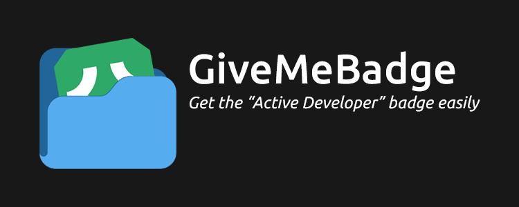

> [!NOTE]
> This repository has been archived and is no longer maintained. The reason is that Discord has decided to discontinue the Developer badge program. As a result, this project has become obsolete. For more information, please refer to the [announcement from Discord](https://support-dev.discord.com/hc/en-us/articles/10113997751447-Active-Developer-Badge) regarding the discontinuation of the Developer badge program.
>
> The repository is kept online for historical reference and learning purposes, I will not be helping with any issues related to this project.

<p align="center">
  
</p>

# Table of contents

- [Table of contents](#table-of-contents)
- [Requirements 🧾](#requirements-)
  - [Video Tutorial 📼](#video-tutorial-)
  - [Usage ✨](#usage-)
    - [✏️ Step 1:](#️-step-1)
    - [✏️ Step 2:](#️-step-2)
    - [✏️ Step 3:](#️-step-3)
    - [✏️ Step 4:](#️-step-4)
    - [✏️ Step 5:](#️-step-5)
    - [✏️ Step 6:](#️-step-6)
    - [✏️ Step 7:](#️-step-7)
    - [✏️ Step 8:](#️-step-8)
    - [✏️ Step 9:](#️-step-9)
  - [Help needed? 📞](#help-needed-)
  - [Contributors 👥](#contributors-)

# Requirements 🧾
- A Discord Bot (create one using the [Discord developer portal](https://discord.com/developers/applications))
- Python 3.8 or above (https://www.python.org/downloads)
  - Recommended version [3.10.2](https://www.python.org/downloads/release/python-3102/)
- A Discord server that you own.
  - Make sure to "enable community" in your server if you haven't already! (`Settings` -> `Enable Community`)

## Video Tutorial 📼
[click here and watch NTTS video on it](https://www.youtube.com/watch?v=Pmo28SdCUUI) (skip to 2:50 if you already have the bot ready from the developer panel)

## Usage ✨


### ✏️ <ins>Step 1:</ins>
Download and install [Python](https://www.python.org/downloads) if you haven't already.

   


### ✏️ <ins>Step 2:</ins>
Open CMD/Terminal inside this folder.
> On Windows, open a `command prompt` as administrator. Type `cd` with a space and drag the desired folder into it. Press enter.

<div align="center">
    
    <br>
    <br>
</div>


<!--
 
-->


### ✏️ <ins>Step 3:</ins>
Install `requirements.txt` with the command below
```
pip install -r requirements.txt
```
> If you are on Windows, you might need to run command prompt as Administrator)


### ✏️ <ins>Step 4:</ins>
Navigate to the [Discord Developer Portal](https://discord.com/developers/applications), sign in to your account, click ***New Application*** and choose any name. Click accept and create. Also heading the `Bot` section and `Add Bot`. If thats your first app you might see the `Bot Token`, If is not just basically click on `Reset Token` and copy, storage it


### ✏️ <ins>Step 5:</ins>
Open the script by using the command. (It might be different, like Linux and MacOS can be using python3)
```
python index.py
```

<div align="center">
    
    <br>
    <br>
</div>

<!--

-->


### ✏️ <ins>Step 6:</ins>
Paste your Discord token by copying it and right-clicking on the application. Some users can also try `CTRL + V` or `CTRL + Shift + V`.
   - **IMPORTANT:** DO NOT share the token! Others can use this to log into your account.
   - Note that to make it respond to your commands, you will need to keep the application/script window alive as it is what runs the bot to begin with. After you are done with everything, you can safely just close it.


### ✏️ <ins>Step 7:</ins>
When the bot has logged in, copy the invite link given to you by highlighting the URL and right-clicking, then go to a browser and paste the URL to invite the bot in to your server. (***REPEAT: Make sure that your server enabled the Community***)


### ✏️ <ins>Step 8:</ins>
Within the server, type `/` and use the `/hello` command provided to you.


### ✏️ <ins>Step 9:</ins>
Go to [This link](https://discord.com/developers/active-developer) and claim your badge.
> It might take 24 hours before you are able to claim at all, so please take time to wait a bit if that is the case.

---

## Help needed? 📞
Join our [Discord server](https://discord.gg/yqb7vATbjH) if you need help.


---

## Contributors 👥
Big thanks to all of the amazing people who have helped by contributing to this project!

<a href="https://github.com/AlexFlipnote/GiveMeBadge/graphs/contributors">
  
</a>

---
<h3 align = "center">


</h3>
